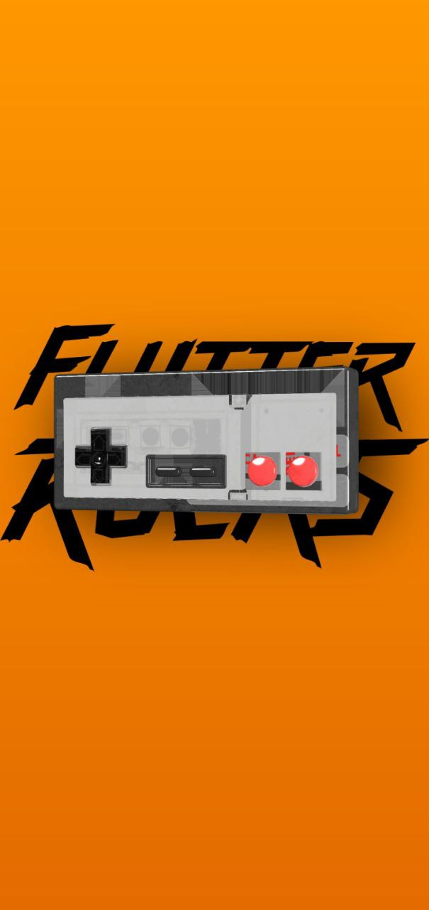

# three_experiment

This is a Experiment of getting 3D elements to work on Flutter. Powered by three_dart and
flutter_gl, this is in experimental phase.

Thanks to [wasabia](https://github.com/wasabia) for working in these pckages!

Thanks to [Denis Sokolov](https://sketchfab.com/donnichols) for providing the NES 3d model under
Creative Commons Attribution

Tested on android (debug only) and macos.

---- 

# Limitations

- One 3d element active at a time
- Does not work well with window resizes
- Buggy on iOS
- Buggy on web
- Limited to circa 40 frames per second
- Three_dart API is not full typsafe. 
- Had to create the shadow with a decorated box and transform it
